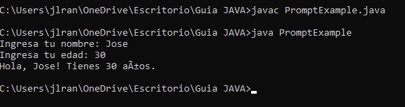

### Implementar un prompt en java

En Java, puedes implementar un prompt básico utilizando la clase Scanner para leer la entrada del usuario desde la consola. Aquí tienes un ejemplo de cómo puedes hacerlo:

```java

import java.util.Scanner;

public class PromptExample {
    public static void main(String[] args) {
        Scanner scanner = new Scanner(System.in);
        
        System.out.print("Ingresa tu nombre: ");
        String nombre = scanner.nextLine();
        
        System.out.print("Ingresa tu edad: ");
        int edad = scanner.nextInt();
        
        System.out.println("Hola, " + nombre + "! Tienes " + edad + " años.");
        
        scanner.close();
    }
}

```

En este ejemplo, utilizamos System.out.print para mostrar el prompt en la consola y luego utilizamos scanner.nextLine() y scanner.nextInt() para leer la entrada del usuario.

Recuerda importar la clase Scanner al principio de tu archivo Java para poder utilizarla. Además, asegúrate de cerrar el objeto Scanner utilizando el método close() al final del programa para liberar los recursos.

Al ejecutar este programa, mostrará el prompt y esperará a que el usuario ingrese el nombre y la edad. Luego, imprimirá un saludo personalizado con los datos proporcionados por el usuario.


### Donde implemento el codigo


El código que te proporcioné se puede implementar en un archivo de Java. Aquí te explico cómo puedes hacerlo:

Abre tu editor de código preferido y crea un nuevo archivo Java.
Copia y pega el código que te proporcioné en el archivo Java.
Guarda el archivo con un nombre significativo y con la extensión ".java", por ejemplo, "PromptExample.java".
Una vez que hayas guardado el archivo, puedes compilar y ejecutar el programa desde la línea de comandos utilizando el compilador de Java. Asegúrate de tener el JDK (Java Development Kit) instalado en tu sistema. A continuación, sigue estos pasos:

Abre la línea de comandos (terminal).
Navega hasta el directorio donde guardaste el archivo Java. Por ejemplo, si el archivo está en el escritorio, puedes usar el comando cd para cambiar al escritorio: cd Desktop.
Compila el archivo Java utilizando el comando javac seguido del nombre del archivo Java. Por ejemplo: javac PromptExample.java.
Después de compilar con éxito, ejecuta el programa utilizando el comando java seguido del nombre de la clase principal (el nombre del archivo sin la extensión ".java"). Por ejemplo: java PromptExample.
El programa se ejecutará y mostrará el prompt en la consola, permitiéndote ingresar el nombre y la edad. Luego, mostrará un saludo personalizado con los datos ingresados.

Recuerda que debes tener el entorno de desarrollo Java configurado correctamente en tu sistema para poder compilar y ejecutar el código Java.

[aqui puedes descargar el JDK](https://www.oracle.com/java/technologies/downloads/#java8)


### Ejemplo




de esta manera se implementa un prompt en Java. Ahora continuaremos con la implementacion de prompt que realice una consulta a chat GPT.


### Paso 1: Conectarnos a Chat GPT

Primero debemos poseer una API Key que nos la proporsionara OpenIA para poder conectarnos

